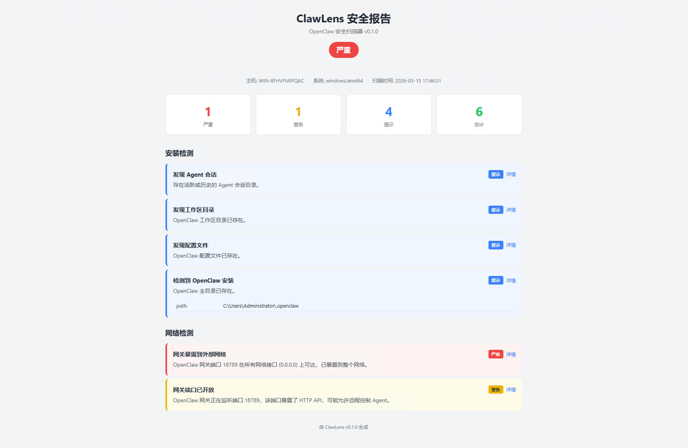

<div align="center">

# ClawLens

**面向企业终端的 OpenClaw 安全扫描器**

快速识别危险配置、凭证风险与网络暴露面 — 单二进制，零依赖，开箱即用。

[](LICENSE)
[](https://go.dev)
[]()

</div>

---

## 核心能力

- **安装发现** — 主目录、配置文件、工作区与会话目录
- **进程检测** — 运行中的 OpenClaw 进程与系统服务
- **风险评估** — 识别 `shellAccess: true`、Gateway 监听 `0.0.0.0` 等高危配置
- **凭证审计** — 检查凭证目录及文件权限是否过宽
- **网络暴露** — 发现对外开放的 Gateway 端口及外部网络可达性
- **内网探测** — 支持指定 IP/网段扫描，发现局域网内 OpenClaw 安装与未授权访问风险
- **治理建议** — 每项风险附带具体修复方案

## 快速开始

```bash
# 从 GitHub Releases 下载，或从源码构建：
make build

# 执行扫描
./clawlens
```

HTML 报告会自动在浏览器中打开。无桌面环境时自动跳过，可将报告文件复制到其他机器查看。

> 完整的命令行选项和平台说明见 [docs/usage.md](docs/usage.md)。

## 报告预览

<div align="center">

</div>

## 参与贡献

详见 [CONTRIBUTING.md](CONTRIBUTING.md)。安全问题披露 → [SECURITY.md](SECURITY.md)。

## 开源许可

[Apache-2.0](LICENSE)
